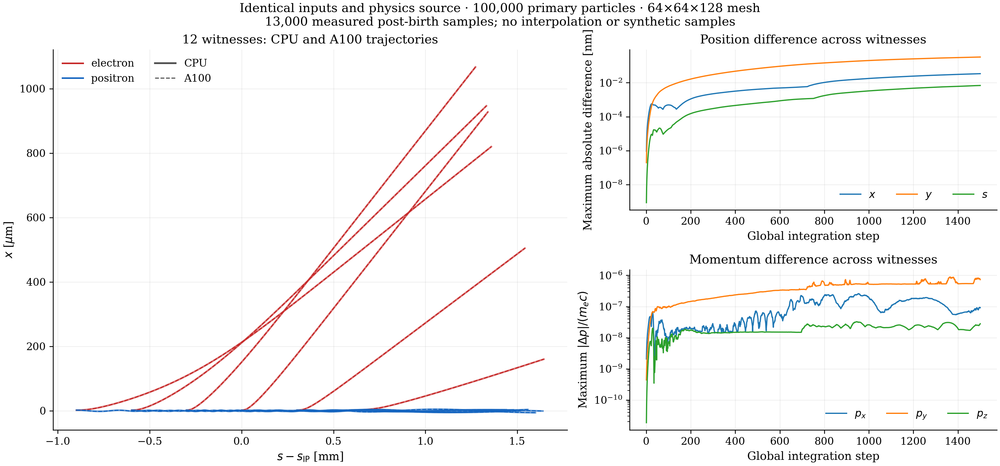

::: {.feature-opalx .beambeam-physics}

## Scope and physical problem {#sec-beam-beam-theory-3d}

Low-energy electron-positron pairs created near a gamma-gamma collider's
interaction point (IP) propagate through the electromagnetic fields of two
counter-propagating primary electron bunches. OPALX calls the high-energy
electron bunches **primaries** and the produced electrons and positrons
**witnesses**. This chapter describes their transport, not pair production
inside `BEAMBEAM`. CAIN supplies witness creation positions, momenta, and times.
Photon and pair-production processes are a separate topic in
[Gamma-Gamma physics](../gamma-gamma/index.qmd).

The implemented approximation tracks one physical primary. Its opposing partner
is constructed by mirror symmetry about the IP, with the same charge and
reversed longitudinal velocity. Witnesses sample these fields without depositing
charge or feeding back on the primary. The benchmark additionally suppresses
the primary's collective kick with `BBRIGID=TRUE`.

::: {.callout-important}
## What the validation establishes

The 12-witness benchmark verifies timed emission and transport in a prescribed
symmetric primary model. Agreement with an independent like-for-like field
model is sub-percent in the reported $x$ and longitudinal trajectory norms.
CAIN comparison gives approximately 9.5% in $x$ and 3.0% longitudinally for
the standard/fine cases, with larger relative discrepancies in weak components
and some individual trajectories. CPU/A100 reproducibility is a third,
separate result. These findings support a restricted initial implementation,
not a claim of a fully converged, self-consistent two-beam collision model.
:::

The [`BEAMBEAM` element reference](../../user-guide/elements.qmd#beambeam)
defines syntax, defaults, and supported combinations.

### Geometry, source parameters, and units {#sec-beam-beam-geometry}

For a placed element beginning at $s_b$ with length $L$, the IP is

$$
s_{\mathrm{IP}}=s_b+\frac{L}{2}.
$$

The production geometry has $s_b=0.01$ m, $L=0.32$ m, and aperture radius
$0.15$ m, hence $s_{\mathrm{IP}}=0.17$ m. The smaller Track-12 benchmark uses
an 8 mm element with IP at 4 mm. Neither physical length sets the current
numerical field-window length.

{#fig-beambeam-geometry width="95%"}

Let $z=0$ denote the IP in the straight interaction frame. Primary centroids at
$-d$ and $+d$ have **centroid separation $2d$**. Distinguish this from the
individual centroid-to-IP distance when specifying field probes or cutoffs.

| Quantity | Benchmark value |
|---|---:|
| Primary kinetic energy $K_0$ | 245 MeV |
| Electrons per primary $N_e$ | $1.25\times10^{10}$ |
| Charge per primary $Q=-N_e e$ | $-2.0027207925\times10^{-9}$ C |
| Laboratory transverse rms sizes $\sigma_x=\sigma_y$ | $1.944325075701\,\mu\mathrm m$ |
| Laboratory longitudinal rms size $\sigma_z$ | $0.6$ mm |
| Controlled source support | Component-wise $\pm3\sigma_i$, renormalized |
| Track-12 witnesses | Six electrons and six positrons |
| Full CAIN population | 1,297 electrons and 1,297 positrons |

These are laboratory bunch dimensions. With
$\gamma_0=1+K_0/(m_ec^2)$, $\beta_0=\sqrt{1-\gamma_0^{-2}}$, the reference
momentum is $p_0=\gamma_0\beta_0m_ec$.
Input `PC` uses GeV/$c$; particle-file momentum components use $p/(m_ec)$.
The positive input `BCHARGE` magnitude and electron species give negative
physical source charge. Fields below use V/m and T; positions use metres.

## Model and numerical field construction {#sec-beam-beam-model}

### Rigid source, quasi-static fields, and passive response {#sec-beam-beam-rigid}

The frozen/rigid-source approximation is intentional. In the controlled
benchmark, primary particles move with their prescribed initial momenta but
do not receive the BeamBeam collective kick. Their charge still deposits on
the mesh, and their changing positions still determine the solved field.
`BBRIGID` therefore does **not** freeze a laboratory field forever, fix particle
positions, or disable external fields. Suppressing collective forces alone also
does not prevent ballistic expansion from an initially divergent source.
The benchmark uses a nearly zero-divergence primary to approximate rigid
translation; a finite-emittance production primary is a different model.

At a collective evaluation the source is treated electrostatically in its
rest-frame approximation, then transformed back to laboratory electromagnetic
fields. The resulting field is sampled for the tracker update and is not
re-solved for every individual witness substep. This is not a full Maxwell
evolution including radiation, retarded interaction between arbitrary bunches,
or independent deformation of the opposing primary.

Only container 0 deposits charge for this interaction. Containers selected by
`WITNESS_CONTAINERS` are passive: neither their self-fields nor their mutual
forces enter the BeamBeam solve. Thus momentum/energy conservation for a closed
system of both primaries and witnesses is not an expected property of the
prescribed-source approximation. Numerical transport must instead be checked
against the same specified fields.

### Poisson solve and Lorentz transformation {#sec-beam-beam-fields}

For source velocity $\mathbf v_s=c\boldsymbol\beta_s$ along $z$, the event
relative to its translating centroid is

$$
x'=x-x_c(t),\qquad y'=y-y_c(t),\qquad
z'=\gamma_s[z-z_c(t)].
$$

The corresponding rms widths are $\sigma_x'=\sigma_x$,
$\sigma_y'=\sigma_y$, and $\sigma_z'=\gamma_s\sigma_z$.
OPALX deposits the primary charge, solves the open-boundary rest-frame problem

$$
\nabla'^2\phi'=-\frac{\rho'}{\epsilon_0},\qquad
\mathbf E'=-\nabla'\phi',\qquad \mathbf B'=0,
$$

and forms laboratory fields. For a longitudinal boost,

$$
E_x=\gamma_s E_x',\qquad E_y=\gamma_s E_y',\qquad E_z=E_z',
\qquad \mathbf B=\frac{\mathbf v_s\times\mathbf E}{c^2}.
$$

The general vector electric-field conversion used by the composer is

$$
\mathbf E=\gamma_s\mathbf E'-(\gamma_s-1)
(\mathbf E'\cdot\widehat{\mathbf v}_s)\widehat{\mathbf v}_s.
$$

The benchmark uses one velocity bin and the integrated open Green function;
the longitudinal mesh spacing is stretched by $\gamma_s$ for the rest-frame
solve. See [Field Solver physics](../field-solver/index.qmd) for the underlying
PIC discretization.

### Mirrored primary and one-solve composition {#sec-beam-beam-mirror}

In the source-aligned coordinates, reflection maps

$$
\mathcal M(x,y,z)=(x,y,2z_{\mathrm{IP}}-z).
$$

For a same-sign mirrored source,

$$
\rho_v(\mathbf r)=\rho_p(\mathcal M\mathbf r),\qquad
\mathbf E'_v(\mathbf r)
=\operatorname{diag}(1,1,-1)\mathbf E'_p(\mathcal M\mathbf r).
$$

The copied mean momentum has its longitudinal component reversed; the same
Lorentz conversion is then applied to the copied field. This is **not** an
opposite-sign conducting-plane image charge. In the straight, head-on case,
$\mathbf v_v=-\mathbf v_p$ and

$$
\mathbf E_{\mathrm{tot}}=\mathbf E_p+\mathbf E_v,\qquad
\mathbf B_{\mathrm{tot}}=\mathbf B_p+\mathbf B_v.
$$

At exact overlap of identical symmetric primaries, the electric field doubles
and the magnetic fields cancel. These are important sign and symmetry checks.

Because reflection and superposition are linear, the symmetric-domain
implementation reuses one physical-source Poisson solve, reflects its field,
and accumulates the two laboratory contributions. The common one-bin,
no-cathode case therefore needs one backend solve per collective evaluation;
an entry diagnostic can require an additional primary-only solve. Distributed
reflection exchanges the required mesh regions, rather than assuming a slab
decomposition. Field arrays remain in their configured Kokkos memory space.
Multi-GPU distributed reflection requires a compatible GPU-aware MPI setup.

### Witness equation of motion and frame mapping {#sec-beam-beam-witness-motion}

For $\mathbf P=\mathbf p/(m_ec)=\gamma\boldsymbol\beta$ and witness charge
$q=\pm e$, the continuous equations represented by the particle pusher are

$$
\frac{d\mathbf x}{dt}=
c\frac{\mathbf P}{\sqrt{1+|\mathbf P|^2}},\qquad
\frac{d\mathbf P}{dt}=\frac{q}{m_ec}
\left[
\mathbf E_{\mathrm{tot}}+
c\frac{\mathbf P}{\sqrt{1+|\mathbf P|^2}}\times\mathbf B_{\mathrm{tot}}
\right].
$$

Particle coordinates are stored relative to each container's reference.
Before interpolation they must be expressed in the primary source frame.
For the straight longitudinal case,

$$
z_{\mathrm{source}}=z_{\mathrm{witness}}+
(s_{\mathrm{witness}}-s_{\mathrm{source}}).
$$

The implementation also applies the reference-frame rotations/translations,
gathers the distributed fields, and returns the sampled vectors to the
witness tracking frame. All MPI ranks participate for a globally nonempty
witness container, even when a rank owns no local witnesses. These details
are essential for low-energy witnesses with reference motion very different
from the high-energy primary.

## Interaction window and mesh policy {#sec-beam-beam-window}

The current numerical longitudinal window has fixed length
$L_f=20$ mm and boundaries $s_\pm=s_{\mathrm{IP}}\pm L_f/2$.
It is independent of physical aperture and element length.
Let $s_{\mathrm{tail}}$ be the minimum primary longitudinal coordinate.

| State | Transition and collective behaviour |
|---|---|
| Inactive | For known `ELEMEDGE` geometry, ordinary self-field solving is suppressed. Activate once $s_{\mathrm{tail}}\ge s_-+L_f/(2N_z)$, including the implemented half-cell entry margin. |
| Active | Solve the primary field; include its mirror only when positive `COPY_TIME` has been reached; gather to configured witnesses. |
| Completed | Enter when $s_{\mathrm{tail}}>s_+$. Restore the saved mesh configuration and stop BeamBeam solving/gathering. Ordinary self fields remain suppressed. Particles continue tracking; completion does not retire/delete the primary. |

A primary first encountered entirely downstream also becomes Completed.
The policy is single-pass: a completed interaction is not reactivated.
For absolute-pose placement, geometry discovery depends on the reference-orbit
map; `ELEMEDGE` is the controlled straight-benchmark placement.

Transverse bounds include the source and configured witness populations, are
padded using `BBOXINCR`, and never shrink during an active interaction.
A second constraint limits excessive cell anisotropy in the source rest frame.
With $A_{\max}=1.5\times10^5$ and
$\Delta z'= \gamma_s L_f/(N_z-1)$, the minimum transverse span is

$$
W_{x,\min}=\frac{\Delta z'(N_x-1)}{A_{\max}},\qquad
W_{y,\min}=\frac{\Delta z'(N_y-1)}{A_{\max}}.
$$

This floor prevents extreme cell shapes encountered with the integrated Green
function; it is not a physical accuracy criterion. More transverse mesh points
can also enlarge the minimum permitted domain. Refinement must therefore
record actual bounds and cell sizes, not only $(N_x,N_y,N_z)$.

The $0.15$ m production aperture and $1.944\,\mu$m primary rms size remain
widely separated scales. A coarse $16^3$ production mesh is useful for a
lifecycle/coverage check, not a converged prediction of kicks or pair losses.
Dynamic transverse coverage does not guarantee longitudinal containment of all
witnesses. Open particle boundaries must not be replaced by periodic wrapping
to keep witnesses artificially inside the field domain.

## CAIN input and exact birth timing {#sec-beam-beam-cain-input}

### Full population {#sec-beam-beam-cain-population}

The CAIN `fort98.txt` table contains 1,297 electron-positron pairs.
Paired particles have the same creation position and time, but different momenta.
Creation times span $-4.137532$ to $+3.237053$ ps relative to the CAIN clock,
with standard deviation $1.037166$ ps. The mean kinetic energy is approximately
313.60 keV for each species; roughly half travel in each longitudinal direction.
They are not a narrow paraxial witness beam.

{#fig-beambeam-cain-times width="85%"}

{#fig-beambeam-cain-directions width="90%"}

Convert CAIN $ct$ in metres to time using $t=ct/c$, and momentum in eV/$c$
to $\mathbf P$ by dividing by $m_ec^2$ expressed in eV. Preserve species,
identity, row pairing, and the creation clock. Emission-source offsets position
the records at the OPALX IP and align their clock with primary overlap.
`EMITTEDFROMFILE` carries `x y z px py pz birth_time` data after its count
and column header; use separate distribution objects for the two species.

### Controlled 12-witness comparison {#sec-beam-beam-track12}

The artificial reference contains six electrons and six positrons born at

$$
ct_b=(-0.9000,-0.5994,-0.3006,0,0.3006,0.5994)\ \mathrm{mm}.
$$

CAIN samples every $\Delta(ct)=1.8\,\mu$m, so
$\Delta t=6.004153713566736$ fs, through $ct=1.8$ mm.
The OPALX preparation aligns these events to the same clock and includes an
initial empty step to establish the fields before the first witness birth.
The reference uses 1,501 steps and 13,012 comparison samples across all witnesses.
These are 13,000 post-birth samples plus 12 initial birth states, not
13,012 samples per particle.

For a witness born within a step ending at $t_{n+1}$, only

$$
\Delta t_i=t_{n+1}-t_{b,i}
$$

is integrated. Exact boundary births and this fractional interval must be
handled consistently. Comparisons align identity and physical time; they must
not substitute row number for particle identity or silently interpolate over
missing output. In the October reproduction, eight birth states were stored
in H5 and four were reconstructed from the known input; all 13,000 post-birth
records were measured.

## Independent manufactured solution {#sec-beam-beam-analytic-solution}

For unchanging anisotropic Gaussian primaries in uniform motion, an independent
evaluator uses the ellipsoidal Coulomb integral [@jackson1999]. In a source rest
frame, for displacement $\mathbf r'$ from its centroid,

$$
E_i'(\mathbf r')=
\frac{Q r_i'}{4\pi\epsilon_0\sqrt{2\pi}}
\int_0^\infty
\frac{\exp\left[-\frac12\sum_j
 r_j'^2/(\sigma_j'^2+u)\right]}
{(\sigma_i'^2+u)\sqrt{\prod_j(\sigma_j'^2+u)}}\,du .
$$

Here $u$ has units of length squared and $Q$ includes the charge sign.
Logarithmic quadrature resolves the very large rest-frame aspect ratio.
Each primary is evaluated in its own rest frame, Lorentz-transformed, and
superposed in the laboratory frame. This evaluator does not call OPALX's
Poisson solver.

The untruncated expression alone is not a like-for-like oracle for a truncated
particle input. The controlled comparisons instead integrate the component-wise
three-sigma-truncated, renormalized density,

$$
\rho'_{\mathrm{tr}}(\mathbf r')=
\frac{\rho'_G(\mathbf r')}{[\operatorname{erf}(3/\sqrt2)]^3}
\prod_{j=x,y,z}\mathbf1_{\{|r_j'|\le3\sigma_j'\}}.
$$

This is a rectangular component-wise cutoff, not a spherical radial cutoff.
The independent witness integration uses both primaries, the exact birth
events, and a maximum internal substep of 1 fs.

A retained physical-plus-mirrored field comparison with 20,301 probes at a
centroid separation of $3\sigma_z$ gives:

| Observable | Value |
|---|---:|
| Maximum OPALX $|\mathbf E|$ | $5.545751\times10^9$ V/m |
| Maximum manufactured $|\mathbf E|$ | $5.553866\times10^9$ V/m |
| Relative $L_2$ error of $\mathbf E$ | 1.1098% |
| Relative $L_2$ error of $\mathbf B$ | 1.1098% |
| Median field-magnitude ratio | 0.997923 |
| Median direction cosine | 0.999970 |

The first-kick scan holds the historical transverse box at
$2.4$ mm by $0.24$ mm with $N_z=128$. It shows a refinement trend approaching
second order, with direction cosine at least 0.999993. Refining $x$ while
coarsening $y$ need not improve the result; this historical fixed-box scan
must not be conflated with current envelope-dependent domain sizing.

{#fig-beambeam-first-kick width="95%"}

## Results and their interpretation {#sec-beam-beam-results}

### Error measures {#sec-beam-beam-metrics}

For matched samples $a_k$ from OPALX and $r_k$ from the stated reference,

$$
\epsilon_{L_2}(a,r)=
\frac{\sqrt{\sum_k(a_k-r_k)^2}}{\sqrt{\sum_k r_k^2}},
\qquad
\operatorname{RMSE}(a,r)=
\sqrt{\frac1N\sum_k(a_k-r_k)^2}.
$$

Tables report $100\epsilon_{L_2}$ as percent. The longitudinal comparison
coordinate $s$ is aligned to the interaction-point convention of the reference.
It is not an uncorrected container-local coordinate. A relative metric becomes
undefined for an exactly zero reference norm and can be large for a small
reference signal; report absolute errors as well. Overall norms also weight
larger-amplitude trajectories more strongly than smaller ones.

### Fine historical benchmark reported in the note {#sec-beam-beam-fine-results}

The retained fine run used 400,000 primary macroparticles,
a $4096\times256\times128$ mesh, four A100s, and the full 1,501-step clock.
Its 13,012-sample comparisons are:

| Reference | $x$ relative $L_2$ | $x$ RMSE ($\mu\mathrm{m}$) | $s$ relative $L_2$ | $s$ RMSE ($\mu\mathrm{m}$) |
|---|---:|---:|---:|---:|
| Truncated manufactured model | 0.6004% | 1.996 | 0.0971% | 0.807 |
| CAIN | 9.5453% | 30.648 | 2.9774% | 24.477 |

{#fig-beambeam-track12-comparison width="100%"}

The twelve first-$x$-kick ratios to the truncated manufactured reference lie
between 0.92947 and 0.97490, with mean 0.94860. The largest charge-conjugate
kick residual is $7.57\times10^{-10}$. These checks support species/sign,
timing, and gather consistency; they do not independently establish equality
of the CAIN and OPALX physical models.

This is a retained historical result, not a new run of the current release
candidate. Its analyzer handled legacy particle-layout/identity conventions;
the retained metadata records a periodic layout and multiple raw IDs per
physical witness, although it reports no transverse wraps. The later
open-boundary reproduction below is a distinct benchmark with stable IDs.
The original note's optimized one-solve comparison reported a 1.992-fold
trajectory speedup, position changes below $0.022\,\mu$m and relative momentum
changes below $4\times10^{-6}$ versus its two-solve predecessor. That timing
is campaign-specific, not a general performance guarantee.

### October open-boundary reproduction {#sec-beam-beam-current-results}

The standard A100 reproduction used 400,000 deterministic primaries,
$256\times256\times128$ cells, `BBRIGID=TRUE`, one velocity bin,
`GREENSF=INTEGRATED`, and open particle boundaries. It completed all 1,501
steps and retained all twelve witness identities. No periodic unwrapping or
time interpolation was needed.

| Reference | $x$ relative $L_2$ | $x$ RMSE ($\mu\mathrm{m}$) | $s$ relative $L_2$ | $s$ RMSE ($\mu\mathrm{m}$) |
|---|---:|---:|---:|---:|
| Truncated manufactured model | 0.8538% | 2.838 | 0.1173% | 0.975 |
| CAIN | 9.4828% | 30.447 | 2.9673% | 24.395 |

The aggregate $x/s$ agreement is stable between these campaigns, but it does
not describe every component or species. For the standard case:

| CAIN comparison | Relative $L_2$ | RMSE ($\mu\mathrm{m}$) |
|---|---:|---:|
| All witnesses, $y$ | 96.18% | 14.764 |
| Positrons only, $x$ | 107.90% | 5.766 |
| Positrons only, $s$ | 0.1019% | 0.881 |

The weak-component discrepancies are real limitations, not values to hide
behind the aggregate norms. The rigid analytic model has zero reference $y$
in this benchmark, so its relative $y$ error is undefined; the OPALX $y$ RMSE
against that model is $1.737\,\mu$m.

CAIN uses a different collective-field treatment. Source emittance, truncation,
force conventions, and the exact original input deck also need alignment before
assigning the residual to a specific cause. The observed discrepancy is
consistent with a model-comparison problem, but the study has not isolated
its cause. Do not tune OPALX tolerances to force agreement with CAIN.

### CPU/A100 reproducibility {#sec-beam-beam-architecture}

The architecture comparison uses **identical** 100,000-primary inputs and
$64\times64\times128$ cells on the local CPU and an A100. It is not a comparison
of the small CPU mesh with the fine historical GPU mesh.
Over 13,000 measured post-birth samples:

| Component | Maximum absolute CPU/A100 difference | Relative $L_2$ |
|---|---:|---:|
| $x$ | 0.03425 nm | $2.6414\times10^{-8}$ |
| $y$ | 0.32758 nm | $1.1660\times10^{-5}$ |
| $s$ | 0.00691 nm | $1.7136\times10^{-9}$ |
| $P_x$ | $2.5921\times10^{-7}$ | $8.4336\times10^{-8}$ |
| $P_y$ | $8.8306\times10^{-7}$ | $1.8055\times10^{-5}$ |
| $P_z$ | $3.2528\times10^{-8}$ | $5.6290\times10^{-9}$ |

Momentum differences are in $p/(m_ec)$. The largest individual-witness/component
relative $L_2$ is 0.0491%, for an electron's weak $P_y$ component.
The CPU and A100 CAIN $x/s$ errors both remain approximately 8.2071%/3.0052%
for this smaller setup. Excellent architecture agreement demonstrates
reproducibility of the specified model, not agreement with a different model.

{#fig-beambeam-cpu-a100 width="100%"}

## Supported scope and further validation {#sec-beam-beam-limitations}

The supported initial scope is a straight, symmetric, single-pass interaction,
with one physical primary, a mirrored partner, and configured passive witnesses.
Multiple elements and repeated `RING`/`TURNS` passages are rejected.
The controlled validation uses no cathode, one velocity bin, and the rigid
primary approximation. It does not establish arbitrary crossing-angle,
unequal-primary, radiation, witness back-reaction, or full-production
loss accuracy.

The historical note proposed a centroid cutoff $d=10\sigma_z=6$ mm:
approximately $\pm20$ ps around primary overlap at 245 MeV. This is **not**
the implemented activation rule and is not an available element parameter.
The current fixed 20 mm window is governed by the primary tail as described
above. A Gaussian density is small at ten rms widths, but its electromagnetic
field remains long-ranged; a physical cutoff needs an impulse-convergence study.

Before interpreting 1,297-pair production losses, vary the timestep, actual
field-domain bounds, mesh spacing, source macroparticle count, source truncation,
and interaction cutoff. Check final momenta and positions, maximum transverse
kick, aperture-loss counts/locations, and coverage for the complete witness
population. Compact source meshes with controlled far-field evaluation or
nested meshes are possible future methods, not current capabilities.

The large-cylinder staged production input still uses common-time `FROMFILE`
injection. Do not confuse it with the separately validated individually timed
full-population input. Align the production birth clock before interpreting
that case as a complete timed CAIN comparison.

The full fine-grid CAIN comparison is extended validation, not a 20-30 second
CI test. Short gtest/text-output regressions should protect field signs,
source-only deposition, passive kicks, exact birth timing, rigid-source response,
single-interaction guards, MPI ownership, and window transitions. This does not
require new Python or HDF5 dependencies in the short regression suite.

## Reproduction and evidence {#sec-beam-beam-reproducibility}

The four studies are available together as a
[downloadable input-and-script bundle](/examples/2026/beam-beam/2026-10-06-beam-beam-experiments.tar.gz).
Use the **Download raw file** button on the linked page to save the archive.
The bundle preserves the shared launchers and cross-experiment analytic helpers;
it contains no generated results, plots, OPALX executable, or Python environment.

The study workspace in the OPALX checkout is organized as:

| Directory | Purpose |
|---|---|
| `sandbox/experiment-1` | Independent anisotropic fields and OPALX field comparisons |
| `sandbox/experiment-2` | Exact-timed Track-12 CAIN/analytic comparisons |
| `sandbox/experiment-3` | Full-population input conversion and exact emission checks |
| `sandbox/experiment-4` | Production geometry, lifecycle, and cylinder diagnostics |

Each contains `inputs/`, `scripts/`, `results/`, and `run.sh`.
`sandbox/Experiments.md` is the operational index.
New runs record inputs, source/executable hashes, commands, and results.
Default local launchers use coarse workflow profiles, not the fine benchmark
settings above. Experiment 4 defaults to a primary-only lifecycle smoke;
it does not track witnesses unless a full case is selected.
The common `--merlin6` launcher option is not yet implemented.
The independent `sandbox/OPALX-IMPACT` study is unchanged.

Extract the archive at the root of an OPALX Git checkout, retaining its
`sandbox/` directory structure. Check for existing experiment files first to
avoid overwriting local work. The archive includes `sandbox/Experiments.md`
and `sandbox/DOWNLOAD.md` with prerequisites and run instructions. Set
`OPALX_PYTHON` to a Python interpreter with NumPy, SciPy, pandas, Matplotlib,
and h5py installed, and select your built executable with `--opalx`:

```bash
tar -xzf /path/to/2026-10-06-beam-beam-experiments.tar.gz
export OPALX_PYTHON=/path/to/python
sandbox/experiment-1/run.sh --opalx /path/to/opalx --smoke
sandbox/experiment-2/run.sh --opalx /path/to/opalx --smoke
sandbox/experiment-3/run.sh --opalx /path/to/opalx
sandbox/experiment-4/run.sh --opalx /path/to/opalx
```

These are scientific study dependencies, not new requirements for the short
regression suite. Results and analysis are generated under each experiment's
`results/` directory. Historical analyses that require omitted output files
must first regenerate or separately obtain those files.

The fine historical table comes from
`experiment-2/results/legacy/opalx/timed/a100_4rank_400k_4096x256x128_twofield_816d11ff8/results/track12_comparison.json`,
relative to `sandbox/`. Its settings and source truncation are recorded in
the matching preparation manifest and analyzer output. The October standard
table and CPU/A100 residuals come from
`tmp/beambeam-cross-architecture-20261002/gpu-standard/results/track12_comparison.json`
and `tmp/beambeam-cross-architecture-20261002/architecture-comparison/comparison.json`
in the validation checkout. That campaign validated a source snapshot including
the device field-clear fix; its executable/content fingerprints, not a bare
branch name, identify the tested state. These local evidence products are not
promised as installed release files.

For reproducibility retain the exact particle-input hashes, source and executable
fingerprints, field domain, mesh, timestep, truncation, MPI decomposition when
comparing architectures, and complete identity/time-aligned output.
Some obsolete raw field dumps and primary snapshots have been deleted to save
space; their figures and comparison summaries remain. Regenerate missing raw
diagnostics before claiming a fresh comparison.

:::
