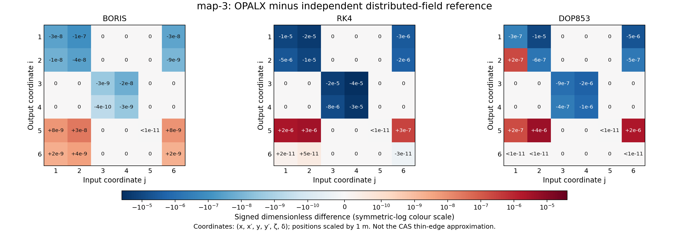

::: {.feature-opalx}

## Additional unpadded six-cell RING {#map3-six-cell-ring}

The separate `sandbox/map-3/ring/build_ring.py` fixture assembles six unchanged
60-degree DBA cells using explicit 6D entrance poses. It retains $\rho=2$ m,
two 30-degree bends, two 1 m drifts and the 0.2 m quadrupole per cell, with
`HGAP=0.1`, `FINT=0.1` and the existing unmatched quadrupole seed. Its design
circumference is

$$
C_{\mathrm{design}}=6\left(2\rho\frac{\pi}{6}+2(1\,\mathrm m)+0.2\,\mathrm m\right)
=25.7663706143592\,\mathrm m.
$$

No fringe padding is added. Thus this is **different geometry** from the
historical separated-support cell studied below, not a reproduction of its
matrix. The existing study inputs, results and provenance remain unchanged.
Finite transverse apertures distinguish neighbouring ring sectors: horizontal
half-width 0.5 m, vertical half-width 0.1 m. These are transverse domain choices,
not longitudinal field cutoffs or changes to the native fringe formulas.

The generator checks nominal position/direction closure and contiguous body
intervals. Its optional OPALX run uses `MAXSTEPS=1` and `--info 2`, saving
`map-3-ring.out`, geometry and provenance. The default
`DOP853`, $\Delta t=10^{-11}$ s, $\epsilon_j=10^{-4}$ and one Richardson level
are smoke-test settings, not a new optimum or convergence claim.
See [geometry, fringe support and ring return](linear-transfer-maps.qmd#fringe-geometry-ring-return)
for the distinction between design closure and a tracked closed orbit.

### Initial ring validation

The `dop853-validation` run completed with those settings and printed
a finite $6\times6$ return matrix. The unchanged quadrupole seed and launch are
**not matched to the unpadded ring**:

| Quantity | Value |
|---|---:|
| Design circumference | 25.7663706144 m |
| Reference return length | 25.3196055628 m |
| Return position mismatch | 0.601429057145 m |
| Relative momentum mismatch | 0.388948624674 |
| $R_{16}$ | 6.346340692238 m |
| $R_{26}$ | 1.343525845901 |
| Printed $\lvert\det M-1\rvert$ | 0.36949810 |
| Printed $\max_{ij}\lvert(M^TJM-J)_{ij}\rvert$ | 68.898765 |

These are return-map diagnostics, **not an accuracy or symplecticity pass**.
The large matrix entries and mismatch require a closed-orbit/optics study before
using this case as an optics regression oracle. The reported coordinates include
noncanonical slopes, and the final momentum is not normal to the reused section;
neither printed residual alone identifies the numerical integration error.
No retuning, fringe renormalization or tolerance relaxation was applied.
The executable SHA-256 was independently checked before and after the run:
`f1a53f9b26b42566c0ad367bf4125d22ba819c06c8e8be24c486dec2202e300e`.
The input, stdout and result provenance are in
`sandbox/map-3/ring/dop853-validation/`. This smoke run validates completion and
the separation of geometry from travelled length, not orbit closure.

## Historical separated-support cell study

This first stage of `sandbox/map-3` defines the **analytic fields**, not an exact
transfer matrix or a matched achromat. It follows `BendFieldModel.h`,
`SBend::makeFieldInputs`, `OpalSBend::update` and `PlacementResolver` on the
`546-add-linear-transfer-matrix-to-each-elemen` development branch.
The initial field-definition stage contains no tracking. The subsequent
[three-case OPALX reproduction](#map3-opalx-runs) is reported below.

The coordinate $s$ is distance along the **nominal placed design line**: straight
entrance tangent, sector arc, straight exit tangent. It is not the path length
of a numerically tracked reference particle. Field components use the local
design-line basis $(x,y,s)$; $B_s$ must not be confused with laboratory $B_z$.
For this horizontal, unrolled lattice, $B_y$ is also the laboratory vertical field.

## Layout with separated supports {#map3-layout}

Keep the map-2 body radius $\rho=2\,\mathrm{m}$, angle
$\theta=\pi/6$, length $L_b=\rho\theta=1.047197551197\,\mathrm{m}$,
quadrupole length $L_q=0.2\,\mathrm{m}$ and two field-free drifts of
$L_d=1\,\mathrm{m}$ each. The agreed fringe parameters are

$$
\mathrm{HGAP}=0.1\,\mathrm{m},\qquad \mathrm{FINT}=0.1,\qquad
g=2\,\mathrm{HGAP}=0.2\,\mathrm{m},\qquad w=5g=1\,\mathrm{m}.
$$

Here $g$ is the full gap and $w$ is the support extension **on each side** of a
bend body. `FINT` is dimensionless and does not set this support width. For a
body entrance at $s_b$, the support is $[s_b-w,s_b+L_b+w)$. `ELEMEDGE` would
specify $s_b$, the geometrical body entrance, not the support entrance.

| Element | Support interval [m] | Nominal body interval [m] |
|:--|:--|:--|
| B1 | 0.000000–3.047198 | 1.000000–2.047198 |
| D1 | 3.047198–4.047198 | same |
| QACH | 4.047198–4.247198 | same |
| D2 | 4.247198–5.247198 | same |
| B2 | 5.247198–8.294395 | 6.247198–7.294395 |

Thus $L_{\mathrm{total}}=2L_b+4w+2L_d+L_q=8.294395102393\,\mathrm{m}$.
Supports touch but do not overlap along this nominal line. D1/D2 contain no
bend fringe. This is not yet a verification of the actual tracked orbit's
three-dimensional element membership or aperture clearance.

## Source-matched Enge envelope {#map3-enge}

Let $z=s-s_b$ be the local longitudinal coordinate relative to a bend body
entrance. The pole-face function is

$$
F(d)=\frac{1}{1+\exp P(u)},\qquad u=\frac{d}{g},\qquad
P(u)=\sum_{i=0}^{5}c_i u^i,
$$

with $d<0$ inside the face and

$$
(c_0,c_1,c_2,c_3,c_4,c_5)=
(0.478959,1.911289,-1.185953,1.630554,-1.082657,0.318111).
$$

The current code uses

$$
A(z)=\min\{F(-z),F(z-L_b)\}.
$$

The smaller envelope selects the active face; a tie selects the entrance.
The external support mask sets the field to zero outside $[-w,L_b+w)$.
For $g=0$, the profile is one with zero derivatives, and the support is simply
$[0,L_b)$, giving the hard-edge limit. The exponential is saturated at
$P>80$ ($F=0$) and $P<-80$ ($F=1$), with zero derivatives there.

Writing $P_d=dP/dd$ and $P_{dd}=d^2P/dd^2$, the unsaturated derivatives are

$$
F_d=-P_dF(1-F),\qquad
F_{dd}=F(1-F)\left[(1-2F)P_d^2-P_{dd}\right].
$$

For the entrance face $A'=-F_d(-z)$; for the exit $A'=F_d(z-L_b)$.
In either case $A''$ is the active face's $F_{dd}$. Primes on $A$ mean
derivatives with respect to $z$, in $\mathrm{m}^{-1}$ and $\mathrm{m}^{-2}$.
The Python implementation uses the equivalent exponential expressions to retain
small derivatives when the floating-point value of $F$ rounds to one.

This is the development branch's Enge model, **not** the older linear-ramp
description. No effective-length rescaling is applied by `OpalSBend::update`.

## Magnetic components and FINT {#map3-components}

For the field normalization, $p_0=0.2505104781131461\,\mathrm{GeV}/c$,
$q=-e$ and $h=1/\rho=0.5\,\mathrm{m}^{-1}$. The physical dipole field is

$$
B_0=\frac{p_0}{q}h=-0.4178065048473403\,\mathrm{T},
$$

where $p_0/q$ is evaluated in SI units. Numerically, for momentum supplied in
$\mathrm{GeV}/c$, the rigidity in tesla-metres is
$B\rho=10^9p_0/[(q/e)c]$, with $c=299792458\,\mathrm{m/s}$.

The sector faces have zero pole-face rotation. Do not specify `E1` or `E2`:
those attributes are currently rejected. The FINT coefficient is

$$
\psi=h\,\mathrm{HGAP}\,\mathrm{FINT},\qquad
k_y=h\tan\psi,\qquad
S=|F(-w)-F(w)|,\qquad C=\frac{B_0}{h}\frac{k_y}{S}.
$$

$\psi$ is an angle in radians, $k_y$ is in $\mathrm{m}^{-1}$ and $C$ is in
tesla. For a pure dipole, the current source's local field components are

$$
\begin{aligned}
B_x &= \sigma C A'(z)y,
&\sigma&=\begin{cases}+1&\text{entrance active},\\-1&\text{exit active},\end{cases}\\
B_y &= B_0\left[A(z)-\frac12 A''(z)y^2\right],\\
B_s &= B_0 A'(z)y.
\end{aligned}
$$

All fields are in tesla and offsets in metres. This reproduces the native
near-axis field law; it does not assert an exact global vacuum-Maxwell solution.
The active-face minimum is piecewise defined, and the external support is
truncated. High-order integration cannot unconditionally assume global
smoothness. For the selected dimensions the envelope reaches the full-field
plateau before the active-face switch.

On the centreline $x=y=0$, $B_x=B_s=0$ and $B_y=B_0A(z)$.
Consequently **FINT is invisible in the centreline field plot**. The additional
diagnostic samples a fixed $x=0$, $y=1\,\mathrm{mm}$ offset and isolates
$\Delta B_x=B_x(\mathrm{FINT}=0.1)-B_x(\mathrm{FINT}=0)$. Entrance and exit
have the same sign of $\Delta B_x$; $B_s$ reverses sign. These are probes of
the field, not tracked rays.

The central standalone quadrupole has $B_x=Gy$, $B_y=Gx$, $B_s=0$. Retaining
the old map-2 value $K_1=-6.371966681365967\,\mathrm{m}^{-2}$ only as an
**unmatched seed** gives $G=-5.324498256290442\,\mathrm{T/m}$.
This sign follows the current `OpalQuadrupole`/`Multipole` convention
$G=(10^9p_0/c)K_1$, which does not include SBEND's division by reference charge.
The quadrupole field therefore vanishes on its nominal centreline even though
its gradient is nonzero.

## Field integral and next validation {#map3-integral}

Adaptive numerical quadrature of the analytic profile gives, for either bend,

$$
\begin{aligned}
L_{\mathrm{eff}}&=\int_{-w}^{L_b+w} A(z)\,dz
=1.047200488015433\,\mathrm{m},\\
\int B_y\,ds&=B_0L_{\mathrm{eff}}=-0.4375271757721572\,\mathrm{T\,m}.
\end{aligned}
$$

The estimated quadrature error is $7.0\times10^{-13}\,\mathrm{m}$; this is
not a field-model accuracy bound. The default coefficients nearly balance the
field lost inside and added outside: $L_{\mathrm{eff}}-L_b\simeq2.94\,\mu\mathrm{m}$.
The nominal-line curvature integral $hL_{\mathrm{eff}}$ corresponds to
$30.00008413^{\circ}$, **not a prediction of actual orbit deflection**. A ray
already bends in the incoming fringe, whereas the nominal line is still straight.

The source repository's `sandbox/map-3/dba/analytic_fields.py` generates the
centreline and off-axis figures, sampled component table, support/body intervals
and a summary containing the source-file hashes. Python tests check support
separation, field-free drifts, derivatives, field signs, symmetry, FINT isolation
and the hard-edge limit; `TestBendFieldModel` checks the C++ profile helpers.

Matching the actual reference orbit and dispersion remains future work. The
unmatched lattice can already be compared with the independent reference below.
The old map-2 hard-edge oracle is not valid for
these fringe fields and larger body separation. Subsequent studies save stdout
with `--info 2`.

## OPALX reproduction with archived best settings {#map3-opalx-runs}

`sandbox/map-3/dba/map-3-dba.in` implements the fields and layout above, retaining
the unmatched quadrupole seed and unscaled dipole strengths. Exactly one case
per map integrator was run sequentially.
`MAXSTEPS=1` limits production tracking; the design OrbitThreader still computes
the complete requested map to $s=8.294395102393196\,\mathrm{m}$.

For each method, select the lowest full-map error among all saved valid
map-2 observations. The previous campaign was incomplete, so these
are **observed minima**, not a complete-grid optimum or a guarantee for map-3.
The RK4 setting in particular may benefit from cancellation in the hard-edge
benchmark. Each listed starting $\epsilon$ is applied to all six coordinates,
in metres or dimensionless units as appropriate.

| Integrator | $\Delta t$ [s] | $\epsilon$ | Richardson levels | $R_{16}$ [m] | $R_{26}$ |
|:--|--:|--:|--:|--:|--:|
| Boris | 1e-13 | 1e-5 | 1 | -1.976821004850 | -0.247747632004 |
| RK4 | 3e-11 | 3e-5 | 0 | -1.976824228889 | -0.247749986316 |
| DOP853 | 1e-11 | 0.003 | 1 | -1.976825802611 | -0.247748090546 |

All three runs completed and visited B1, D1, QACH, D2 and B2, with no recorded
support overlaps. Logged fields in D1/D2 are exactly zero. Evaluate the analytic
field at each logged **global reference position**, including the sector/tangent
chart and placed element frames: this agrees with the logged OPALX field within
the eight-significant-digit text precision. A comparison at equal nominal $s$
would conflate field differences with the reference orbit's displacement.
Samples ambiguous at a hard quadrupole face after text rounding are counted
separately and excluded from this pointwise field check: 0 Boris, 44 RK4 and
44 DOP853 samples. This is not a verification of integration accuracy or of
off-axis FINT gradients from the on-plane reference samples alone.

The finite support is traversed slightly earlier in actual path length than
the nominal layout suggests. For Boris, B2 ends near $s=8.288374822\,\mathrm{m}$;
the combined map includes the remaining field-free interval up to ZSTOP.
The last design-path log entry is a trial midpoint recorded before endpoint
localization and must not be interpreted as the final map plane.

| Integrator | $\lvert\det M-1\rvert$ | $\max_{ij}\lvert(M^TJM-J)_{ij}\rvert$ | OrbitThreader wall time [s] |
|:--|--:|--:|--:|
| Boris | 7.7564677e-9 | 9.6620733e-9 | 41.60 |
| RK4 | 1.0262537e-6 | 1.0222106e-6 | 2.898 |
| DOP853 | 1.7433327e-7 | 5.6822864e-7 | 19.49 |

The unchanged $10^{-6}$ diagnostic threshold passes for Boris and DOP853;
RK4 is slightly above it in both diagnostics. Canonical-$J$ caveats from the
[map chapter](linear-transfer-maps.qmd#diagnostics-and-validation) still apply.
Timing comes from each retained `timing.dat` and includes reference threading,
map construction and related output. These are single observations at different
settings, **not a matched-accuracy efficiency comparison**.

The largest entrywise differences over all 36 matrix entries are
$4.0507220\times10^{-5}$ (Boris–RK4), $9.8690230\times10^{-6}$
(Boris–DOP853), and $3.8389460\times10^{-5}$ (RK4–DOP853).
These are cross-method differences, not errors relative to an analytic map.
The large nonzero dispersion reflects the unmatched lattice, not a residual
that should be compared with the map-2 achromat's zero dispersion.

The source-tree runner and validator retain each full matrix, input, stdout
with `--info 2`, timing, field/support data, and source/selection hashes in
`sandbox/map-3/dba/opalx-best-settings`. No production numerical algorithms or
tolerances were changed for these three runs. No OPALX convergence sweep was
started; the subsequent independent reference calculation is described below.

## CERN analytic edge map and convention check {#map3-cas-edge}

Analytic linear fringe maps **are available**. For example, Silke Van der
Schueren's [CERN lecture, *Dipole fringing fields*, 17 September 2024,
slides 23–29](https://indico.cern.ch/event/1462429/contributions/6157280/attachments/2937404/5159798/Numerical_methods_tracking-2.pdf)
derives the fringe integral and gives the thin-edge matrix. In the usual
full-gap convention, with face rotation $E$ and signed curvature $h$,

$$
\begin{aligned}
K&=\frac{1}{g}\int_{-\infty}^{\infty}
\frac{B_y(s)[B_0-B_y(s)]}{B_0^2}\,ds,\qquad g=2\,\mathrm{HGAP},\\
\psi_{\mathrm{CAS}}&=h g K\frac{1+\sin^2 E}{\cos E},\\
k_x&=h\tan E,\qquad k_y=-h\tan(E-\psi_{\mathrm{CAS}}).
\end{aligned}
$$

The integral is over **one fringe**, not both ends of a finite magnet. Here
$K=\mathrm{FINT}$. The full-gap definition and the same correction are also
explicit in [Zhang and Loulergue, IPAC 2013, equations 1–4](https://accelconf.web.cern.ch/IPAC2013/papers/wepea003.pdf).
The edge matrix in $(x,x',y,y',\zeta,\delta)$ is the identity except
$R_{21}=k_x$ and $R_{43}=k_y$. This linear matrix has determinant one and
preserves the canonical $J$; a finite-order nonlinear truncation is a different
question.

For the present zero-rotation faces,

$$
\psi_{\mathrm{CAS}}=0.010\,\mathrm{rad},\qquad
k_{y,\mathrm{CAS}}=0.005000166673\,\mathrm{m}^{-1}.
$$

**Source discrepancy, not corrected in this study:** the current
`BendFieldModel::edgeVerticalKickCoefficient` uses $h\,\mathrm{HGAP}\,\mathrm{FINT}$,
giving $\psi=0.005\,\mathrm{rad}$ and
$k_y=0.002500020834\,\mathrm{m}^{-1}$. `OpalSBend` doubles HGAP into the stored
full gap, and `SBend::makeFieldInputs` passes half that stored gap to the helper;
there is no compensating factor of two. The existing unit test follows the
current half-gap expression. These numbers compare the **explicit edge
coefficient**, not the total focusing through the distributed fringe.

Furthermore, the current Enge profile is fixed by its coefficients and gap;
FINT changes an added off-axis field term, not the profile's integral $K$.
Consequently the distributed model cannot simply be identified with the CERN
thin-edge model by inserting the same two input values. Changing that physical
model requires a separate decision and validation, not a numerical tolerance
adjustment.

`compare_reference.py` evaluates the analytic thin-edge DBA by composing its
two body bend maps, four edge maps, central quadrupole and drifts. It retains
all body positions: the two outer drifts are $w$, and each inner body-to-quad
drift is $w+L_d$. This uses the **nominal design orbit and rigidity**, not the
slightly displaced tracked orbit. It gives
$R_{16}=-1.929713679677\,\mathrm{m}$ and $R_{26}=-0.207853671267$.
The differences below are OPALX minus this **different physical approximation**:

| Integrator | $\Delta R_{16}$ [m] | $\Delta R_{26}$ | Largest scaled entry difference |
|:--|--:|--:|--:|
| Boris | -0.04710732517 | -0.03989396074 | 0.3926250678 |
| RK4 | -0.04711054921 | -0.03989631505 | 0.3926456112 |
| DOP853 | -0.04711212293 | -0.03989441928 | 0.3926349368 |

These are not integration-error estimates. In particular, the zero-rotation
FINT edge correction changes only the vertical block, so the substantial
horizontal/dispersion differences cannot be attributed to that coefficient's
factor of two. Distributed bending and the reference orbit also differ.

## Independent distributed-field map comparison {#map3-reference-comparison}

To isolate numerical map errors for the **fields actually run**, independently
integrate their variational Lorentz equations. This is a numerically evaluated
analytic-field reference, **not a closed-form solution** and not a replacement
for the CERN analytic approximation above.

Use actual particle path length $\ell$ in metres, $\mathbf k=\mathbf u/u_0$,
$\kappa=\lVert\mathbf k\rVert$, $\mathbf n=\mathbf k/\kappa$ and
$\tau=\beta_0ct$ in metres, where $\mathbf u=\boldsymbol\beta\gamma$.
With $\alpha=(q/e)c/[(mc^2)_{\mathrm{eV}}u_0]$ in $(\mathrm{T\,m})^{-1}$,

$$
\begin{aligned}
\frac{d\mathbf r}{d\ell}&=\mathbf n, &
\frac{d\mathbf k}{d\ell}&=\alpha\,\mathbf n\times\mathbf B(\mathbf r),\\
\frac{d\tau}{d\ell}&=\beta_0\frac{\sqrt{\kappa^2+u_0^{-2}}}{\kappa}, &
\frac{dT}{d\ell}&=\frac{\partial f}{\partial z}T.
\end{aligned}
$$

Here $z=(\mathbf r,\mathbf k,\tau)$, $f=dz/d\ell$, and the $7\times6$
matrix $T$ differentiates this state with respect to the six entrance map
coordinates. The source provides analytic field derivatives on the planar
reference, **including vertical derivatives** needed for FINT. No shadow-ray
differencing or OPALX calls are used. At a hard quadrupole face with state-space
normal $\nu=(\mathbf n_{\mathrm{face}},0,0,0,0)$, account for perturbed crossing
times with

$$
T^+=\left[I+\frac{(f^+-f^-)\nu^T}{\nu^Tf^-}\right]T^-.
$$

This is the [saltation sensitivity update](https://arxiv.org/abs/2306.06862).
At the end, project onto the common reference-normal plane before encoding
slopes, $\zeta=-\beta_{\mathrm{ref}}c\,\Delta t$, and relative momentum.
The endpoint is the reference's requested path length
$\ell=8.294395102393196\,\mathrm{m}$, including its final field-free interval.

The distribution uses $u_0=490.23677597553325$. With the current electron mass
$mc^2=0.00051099895\,\mathrm{GeV}$ its momentum is
$0.2505104777748827\,\mathrm{GeV}/c$, slightly different from the explicit
field-normalization P0 above. The reference preserves both values as run.

Adaptive SciPy DOP853 refinement gives a maximum entry change of
$2.0233\times10^{-11}$ between the last two settings; an independent RK45
integration differs by $1.7714\times10^{-11}$. This is a convergence check,
not a rigorous absolute error bound. The selected reference uses relative
tolerance $3\times10^{-14}$, absolute tolerance $3\times10^{-16}$ and maximum
path step $0.005\,\mathrm{m}$. Its determinant and canonical-$J$ residuals are
$1.24\times10^{-12}$ and $9.97\times10^{-13}$ respectively.

Full-matrix tests cover exact drift, quadrupole and uniform relativistic bend;
additional tests check the analytic field/Lorentz Jacobians, off-axis hard-face
crossing sensitivity against independently integrated rays, momentum
normalization and the DOP853/RK45 comparison. The tolerances in these independent
Python checks do not modify OPALX's existing diagnostics.

The distributed-field reference gives
$R_{16}=-1.976820978591533\,\mathrm{m}$ and
$R_{26}=-0.247747623262620$. Define $\Delta M=M_{\mathrm{OPALX}}-M_{\mathrm{ref}}$.
For an unambiguous dimensionless whole-map comparison, scale $x,y,\zeta$ by
$L_*=1\,\mathrm{m}$ and leave slopes and relative momentum dimensionless.
This is a coordinate scale, **not an element length**. Numerically the scaled
entries equal the stored SI entries here.

| Integrator | $\Delta R_{16}$ [m] | $\Delta R_{26}$ | Maximum scaled entry error | Entry |
|:--|--:|--:|--:|:--|
| Boris | -2.62585e-8 | -8.74138e-9 | 9.64778e-8 | $R_{12}$ |
| RK4 | -3.25030e-6 | -2.36305e-6 | 4.05225e-5 | $R_{34}$ |
| DOP853 | -4.82402e-6 | -4.67283e-7 | 9.96550e-6 | $R_{12}$ |

These include all map-construction effects, not only the integrator's local
truncation error. Boris is closest at these particular archived settings;
this does not establish an integrator ranking at equal cost or after tuning.

For the complete OPALX matrices, signed determinant errors calculated from the
saved, text-rounded entries are approximately
$-7.76\times10^{-9}$ (Boris), $-1.03\times10^{-6}$ (RK4), and
$-1.74\times10^{-7}$ (DOP853). OPALX stdout reports their absolute values
before matrix text rounding; those more precise magnitudes remain in the
earlier run table. Determinant one is necessary but not sufficient for
symplecticity.

Reproduction scripts and tests are under `sandbox/map-3/dba`. The validated
reference, refinements and source hashes are in `variational-reference-validated/`;
`map-comparison/` contains each full signed difference matrix, the separate
CAS matrix, summary CSV, heatmap and provenance. The original three OPALX
runs are unchanged. No new OPALX simulations or production-code changes were
made for this comparison.

:::
